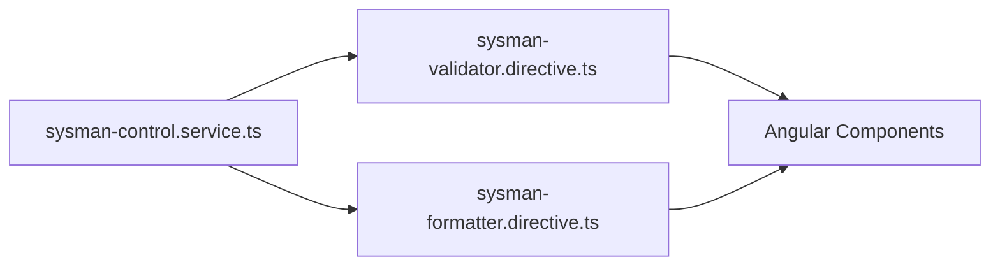

# Sysman Control Inputs 
this lib conforms by the next files
`1. sysman-control.service.ts`
`2. sysman-validator.directive.ts`
`3. sysman-formatter.directive.ts`





## Sysman validator 
this is a directive that use for permit the entry of some chars in the field that contains them 
```html
<input SysmanValidator="onlyNumbers" matInput placeholder="onlyNumbers" >
<input SysmanValidator="onlyLowerCaseLetters" matInput placeholder="onlyLowerCaseLetters" >
```
the input parameter is set in a json constant in the service `sysman-control.service.ts` that consumes.

if its necessary create a new rule add the ruleName and pattern in the json 
```js
const patterns = {
  onlyNumbers: '1234567890',
  onlyLowerCaseLetters: 'abcdefghijklmnñopqrstuvwxyz',
  onlyUpperCaseLetters: 'ABCDEFGHIJKLMNÑOPQRSTUVWXYZ',
  onlyLetters: 'abcdefghijklmnñopqrstuvwxyzABCDEFGHIJKLMNÑOPQRSTUVWXYZ',
  decimalNumbers:'1234567890.',
  newRuleName: 'newpattern'
}
```
the pattern are the chars accepted, and ruleName is the parameter that we pass to the directive

## Sysman Formatter
this directive change the format of the field that contains him
```html
<input SysmanFormatter='creditCard' matInput placeholder="SysmanFormatterCard" >
<input SysmanFormatter='upperCase' matInput placeholder="SysmanFormatterUpper" >
```
the input parameter defines the accepted format in the field and ajust them
if need add a new format, have to develop step by step and include in the service `sysman-control.service.ts` as a case on method formatter and the assing a formatName to the case and this is the string that we pass as parameter in te directive

present formats :
`1) upperCase `
`2) lowerCase `
`3) creditCard `
`4) milesDots`

## Sysman Control 
this contains all functions required by the directives of this package. Is a service cause we need global access to the functions

